# 인프라 통합 구성도 - 정밀 토폴로지

## 시스템 개요

본 문서는 버티포트 통합운용시스템(IVS)과 버티포트 운용시스템(VOS) 간의 상세 네트워크 토폴로지를 정의합니다.

## 네트워크 토폴로지 다이어그램

```mermaid
graph TB
    subgraph 관제실["🏢 관제실 (Control Room)"]
        DID["DID Monitor"]
        IPWALL["Ipwall Controller"]
        IPC1["통합운용PC #1"]
        IPC2["통합운용PC #2"]
        IPC3["통합운용PC #3"]
        VCDMPC["VCDMPC"]
        L2_CONTROL["L2 Switch"]
        
        DID --- L2_CONTROL
        IPWALL --- L2_CONTROL
        IPC1 --- L2_CONTROL
        IPC2 --- L2_CONTROL
        IPC3 --- L2_CONTROL
        VCDMPC --- L2_CONTROL
    end

    subgraph 서버실_IVS["🖥️ 서버실 - IVS (통합운용시스템)"]
        L3_IVS["L3 Switch"]
        L2_IVS["L2 Switch"]
        
        subgraph WAS_IVS["WAS서버 (IVS)"]
            WAS_VM1["VM #1<br/>Model: XXX<br/>CPU: XX Core<br/>MEM: XX GB<br/>Disk: XX TB"]
            WAS_VM2["VM #2<br/>Model: XXX<br/>CPU: XX Core<br/>MEM: XX GB<br/>Disk: XX TB"]
        end
        
        subgraph WEB_IVS["WEB서버 (IVS)"]
            WEB_VM1["VM #1<br/>Model: XXX<br/>CPU: XX Core<br/>MEM: XX GB<br/>Disk: XX TB"]
            WEB_VM2["VM #2<br/>Model: XXX<br/>CPU: XX Core<br/>MEM: XX GB<br/>Disk: XX TB"]
        end
        
        subgraph DB_IVS["통합DB서버 (IVS)"]
            DB_VM1["VM #1<br/>Model: XXX<br/>CPU: XX Core<br/>MEM: XX GB<br/>Disk: XX TB"]
            DB_VM2["VM #2<br/>Model: XXX<br/>CPU: XX Core<br/>MEM: XX GB<br/>Disk: XX TB"]
        end
        
        subgraph VCDM_IVS["VCDM운용서버"]
            VCDM_VM1["VM #1<br/>Model: XXX<br/>CPU: XX Core<br/>MEM: XX GB<br/>Disk: XX TB"]
            VCDM_VM2["VM #2<br/>Model: XXX<br/>CPU: XX Core<br/>MEM: XX GB<br/>Disk: XX TB"]
        end
        
        CEC["CEC 미들웨어<br/>Model: XXX<br/>CPU: XX Core<br/>MEM: XX GB<br/>Disk: XX TB"]
        VOS_MGR["VOS운용관리서버 #1<br/>Model: XXX<br/>CPU: XX Core<br/>MEM: XX GB<br/>Disk: XX TB"]
        
        L3_IVS --- WAS_IVS
        L3_IVS --- WEB_IVS
        L3_IVS --- DB_IVS
        L3_IVS --- VCDM_IVS
        L3_IVS --- L2_IVS
        L2_IVS --- CEC
        L2_IVS --- VOS_MGR
    end

    subgraph 서버실_VOS_1_7["🛩️ 서버실 - VOS #1~#7"]
        L2_VOS_1_7["L2 Switch"]
        
        VOS_SRV1["VOS운용서버 #1<br/>Model: XXX<br/>CPU: XX Core<br/>MEM: XX GB<br/>Disk: XX TB"]
        VOS_SRV2["VOS운용서버 #2<br/>Model: XXX<br/>CPU: XX Core<br/>MEM: XX GB<br/>Disk: XX TB"]
        VOS_SRV3["VOS운용서버 #3<br/>Model: XXX<br/>CPU: XX Core<br/>MEM: XX GB<br/>Disk: XX TB"]
        VOS_SRV4["VOS운용서버 #4<br/>Model: XXX<br/>CPU: XX Core<br/>MEM: XX GB<br/>Disk: XX TB"]
        
        VP_PC_1_2["VP운용PC #1, #2"]
        VP_PC_3_4["VP운용PC #3, #4"]
        VP_PC_5_6["VP운용PC #5, #6"]
        VP_PC_7["VP운용PC #7"]
        
        L2_VOS_1_7 --- VOS_SRV1
        L2_VOS_1_7 --- VOS_SRV2
        L2_VOS_1_7 --- VOS_SRV3
        L2_VOS_1_7 --- VOS_SRV4
        L2_VOS_1_7 --- VP_PC_1_2
        L2_VOS_1_7 --- VP_PC_3_4
        L2_VOS_1_7 --- VP_PC_5_6
        L2_VOS_1_7 --- VP_PC_7
    end

    subgraph 서버실_VOS_8["🔒 서버실 - VOS #8 (단독형)"]
        UTM["UTM Firewall"]
        L2_VOS_8_1["L2 Switch #1"]
        L2_VOS_8_2["L2 Switch #2"]
        L2_VOS_8_3["L2 Switch #3"]
        
        VP_TERM1["VP운용단말 #1"]
        VP_TERM2["VP운용단말 #2"]
        VP_TERM3["VP운용단말 #3"]
        VP_TERM4["VP운용단말 #4"]
        
        GROUND_CON["지상감시콘솔"]
        SITUATION_CON["상황인식콘솔"]
        NWICS_CON["NWICS콘솔"]
        
        MSDP["MSDP 감시SW<br/>중앙서버"]
        ADSB["ADSB 수신기"]
        VULN["취약점 분석장치"]
        
        FIXED_CAM["고정카메라<br/>영상처리서버"]
        PTZ_CAM["PTZ카메라<br/>영상처리서버"]
        
        UTM --- L2_VOS_8_1
        L2_VOS_8_1 --- VP_TERM1
        L2_VOS_8_1 --- VP_TERM2
        L2_VOS_8_1 --- VP_TERM3
        L2_VOS_8_1 --- VP_TERM4
        
        L2_VOS_8_2 --- GROUND_CON
        L2_VOS_8_2 --- SITUATION_CON
        L2_VOS_8_2 --- NWICS_CON
        L2_VOS_8_2 --- MSDP
        L2_VOS_8_2 --- ADSB
        L2_VOS_8_2 --- VULN
        
        L2_VOS_8_3 --- FIXED_CAM
        L2_VOS_8_3 --- PTZ_CAM
        
        UTM --- L2_VOS_8_2
        UTM --- L2_VOS_8_3
    end

    subgraph 서버실_VSS["📊 서버실 - VSS"]
        L2_VSS["L2 Switch"]
        VSS_PC1["VSS운용PC #1"]
        MAP_PC["맵서비스PC"]
        VSS_SRV["VSS운용서버<br/>Model: XXX<br/>CPU: XX Core<br/>MEM: XX GB<br/>Disk: XX TB"]
        
        L2_VSS --- VSS_PC1
        L2_VSS --- MAP_PC
        L2_VSS --- VSS_SRV
    end

    WAN["☁️ WAN"]
    
    L2_CONTROL -.->|관제실 연결| L3_IVS
    L3_IVS <-->|인터넷| WAN
    L2_VOS_1_7 <-->|인터넷| WAN
    UTM <-->|방화벽 경유| WAN
    L2_VSS <-->|인터넷| WAN

    classDef ivsStyle fill:#4A90E2,stroke:#2E5C8A,stroke-width:3px,color:#fff
    classDef vosStyle fill:#7CB342,stroke:#558B2F,stroke-width:3px,color:#fff
    classDef vos8Style fill:#FF8A65,stroke:#D84315,stroke-width:3px,color:#fff
    classDef vssStyle fill:#9C27B0,stroke:#6A1B9A,stroke-width:3px,color:#fff
    classDef networkStyle fill:#607D8B,stroke:#37474F,stroke-width:2px,color:#fff
    classDef wanStyle fill:#00BCD4,stroke:#0097A7,stroke-width:3px,color:#fff
    
    class WAS_IVS,WEB_IVS,DB_IVS,VCDM_IVS,CEC,VOS_MGR ivsStyle
    class VOS_SRV1,VOS_SRV2,VOS_SRV3,VOS_SRV4,VP_PC_1_2,VP_PC_3_4,VP_PC_5_6,VP_PC_7 vosStyle
    class UTM,VP_TERM1,VP_TERM2,VP_TERM3,VP_TERM4,GROUND_CON,SITUATION_CON,NWICS_CON,MSDP,ADSB,VULN,FIXED_CAM,PTZ_CAM vos8Style
    class VSS_PC1,MAP_PC,VSS_SRV vssStyle
    class L2_CONTROL,L3_IVS,L2_IVS,L2_VOS_1_7,L2_VOS_8_1,L2_VOS_8_2,L2_VOS_8_3,L2_VSS networkStyle
    class WAN wanStyle
```

## 서버 구성 상세

### IVS 서버 (각 2개 VM 구성)

| 서버 유형 | VM | 사양 |
|---------|-----|------|
| **WAS서버** | VM #1 | Model: [모델명] CPU: [코어수] MEM: [용량] Disk: [용량] |
| | VM #2 | Model: [모델명] CPU: [코어수] MEM: [용량] Disk: [용량] |
| **WEB서버** | VM #1 | Model: [모델명] CPU: [코어수] MEM: [용량] Disk: [용량] |
| | VM #2 | Model: [모델명] CPU: [코어수] MEM: [용량] Disk: [용량] |
| **통합DB서버** | VM #1 | Model: [모델명] CPU: [코어수] MEM: [용량] Disk: [용량] |
| | VM #2 | Model: [모델명] CPU: [코어수] MEM: [용량] Disk: [용량] |
| **VCDM운용서버** | VM #1 | Model: [모델명] CPU: [코어수] MEM: [용량] Disk: [용량] |
| | VM #2 | Model: [모델명] CPU: [코어수] MEM: [용량] Disk: [용량] |

### VOS 서버 (단일 구성)

| 서버 유형 | 사양 |
|---------|------|
| **VOS운용서버 #1** | Model: [모델명] CPU: [코어수] MEM: [용량] Disk: [용량] |
| **VOS운용서버 #2** | Model: [모델명] CPU: [코어수] MEM: [용량] Disk: [용량] |
| **VOS운용서버 #3** | Model: [모델명] CPU: [코어수] MEM: [용량] Disk: [용량] |
| **VOS운용서버 #4** | Model: [모델명] CPU: [코어수] MEM: [용량] Disk: [용량] |

## 네트워크 연결 구조

### 1. 관제실 ↔ 서버실 연결
- **L2 Switch (관제실)** → **L3 Switch (IVS)**
- 통합운용PC, VCDMPC 등 관제 장비가 IVS 시스템에 접근

### 2. IVS 내부 연결
- **L3 Switch** 중심의 스타 토폴로지
- WAS, WEB, DB, VCDM 서버 각각 2개 VM으로 이중화
- **L2 Switch**를 통해 CEC 미들웨어 및 VOS 관리서버 연결

### 3. VOS #1~#7 연결
- **L2 Switch** 중심으로 4개 운용서버 연결
- 7개 VP운용PC 연결 (각 버티포트별 운용 콘솔)

### 4. VOS #8 (단독형) 연결
- **UTM 방화벽**을 통한 보안 접근
- 3개 L2 Switch로 구역 분리:
  - Switch #1: VP운용단말 (4대)
  - Switch #2: 감시/분석 시스템 (콘솔, MSDP, ADSB, 취약점분석)
  - Switch #3: 영상처리 시스템 (고정/PTZ 카메라)

### 5. WAN 연결
- IVS: L3 Switch 통해 직접 연결
- VOS #1~#7: L2 Switch 통해 연결
- VOS #8: UTM 방화벽 경유 연결
- VSS: L2 Switch 통해 연결

## 주요 특징

1. **IVS 이중화**: 모든 IVS 서버는 2개 VM으로 구성되어 고가용성 보장
2. **계층적 네트워크**: L3 스위치(IVS 코어) → L2 스위치(각 시스템) 구조
3. **보안 구역 분리**: VOS #8은 UTM을 통한 독립적 보안 영역
4. **WAN 연결**: 각 시스템별 독립적인 인터넷 연결 경로
